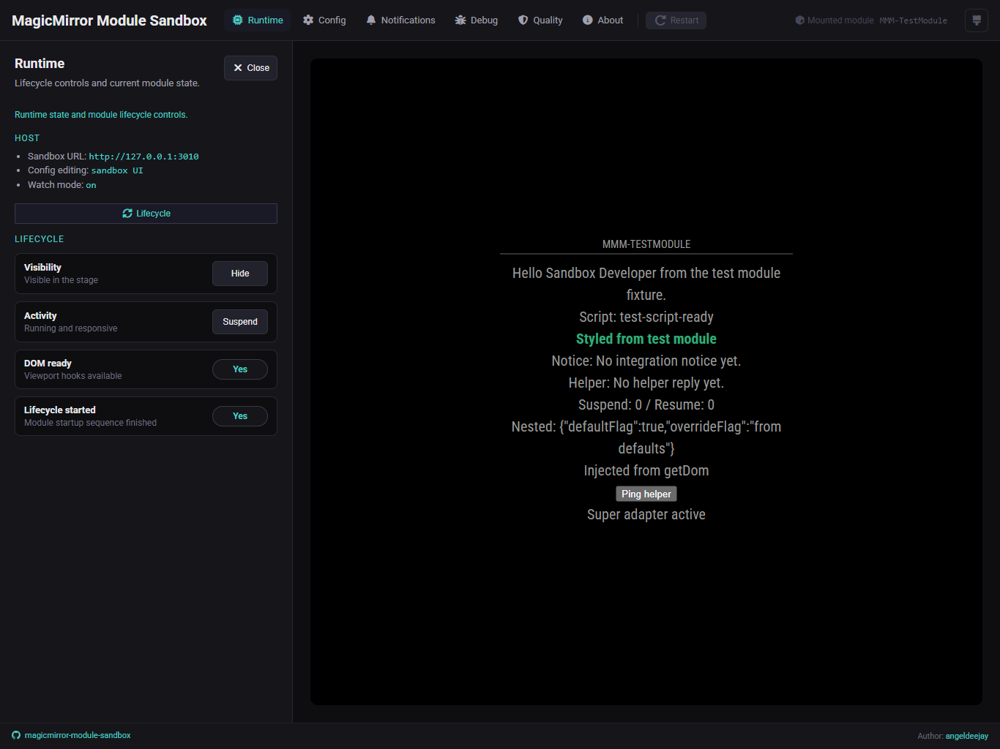

# 📚 Sandbox manual

These pages walk through the main parts of the MagicMirror Module Sandbox UI.

## What you will find here

The sidebar is organized into six main areas:

- [Runtime](runtime.md)
- [Config](config.md)
- [Notifications](notifications.md)
- [Debug](debug.md)
- [Quality](quality.md)
- [About](about.md)

These guides describe the sandbox as it exists today. They are meant to help
you use the product, not to promise broad compatibility outside the supported
slice.

## A simple way to use the sandbox

1. Start the sandbox from the consumer module root with either `npx @angeldeejay/magicmirror-module-sandbox@latest` or a locally installed `npx magicmirror-module-sandbox`.
2. Open `http://127.0.0.1:3010`.
3. Use the topbar to open one sidebar domain at a time.
4. Interact with the mounted module in the stage while inspecting logs and state from the sidebar.

## A few helpful notes

- Mounted-module config is resolved from three sources in priority order: `config.sandbox.json` in the module root (highest), `package.json → sandbox.moduleConfig` (read-only seed, promoted to `config.sandbox.json` on first save), or a sandbox-owned temp file as fallback. See [Config](config.md) for details.
- Runtime language/locale persistence stays in a sandbox-owned temp file beside the module config.
- Each module repo keeps its own saved config by default; switching projects does not silently reuse another module's persisted editor state.
- `node_helper.js` is optional. Frontend-only modules still mount as long as the frontend entry can be detected.
- Watch mode emits reload events with fresh versioned stage URLs so stage-local changes refresh the iframe without keeping stale browser-cached assets.
- The sandbox mounts one real MagicMirror module at a time, not a multi-module layout.
- The screenshots in this manual are maintained from the preview fixture so they track the current sandbox UI rather than a stale mockup.
