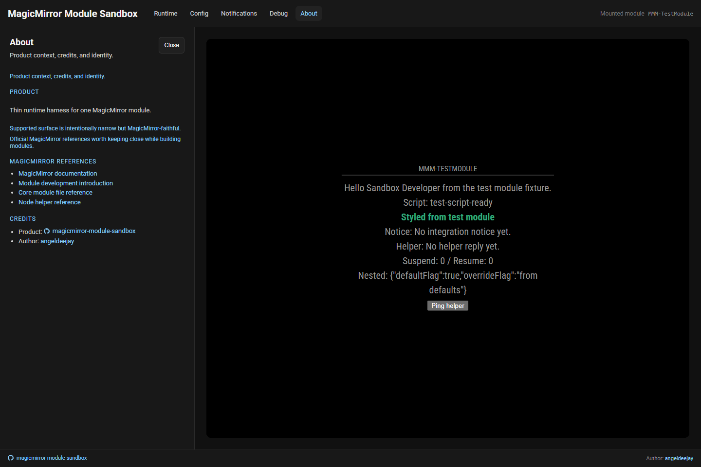

# ℹ️ About

The **About** area gives you the quick product story and a few useful links.

## What you will see

- short product statement
- MagicMirror reference links
- product and author credits
- enough context to distinguish one-off `npx` usage from local package installation

## When it helps most

Open About when you want to:

- confirm what the sandbox is trying to be
- jump out to the relevant MagicMirror references
- sanity-check that you are working inside the right product surface

## Notes

- The sandbox is intentionally narrow and MagicMirror-faithful only for the supported slice it documents.
- It is designed for third-party modules, not for MagicMirror core modules or integrations that require bundled core modules.
- About is a lightweight orientation panel, not a full manual.
- Packaging/install policy still matters: this tool is meant to be used as a CLI/dev tool, not as a production runtime dependency of a module.
