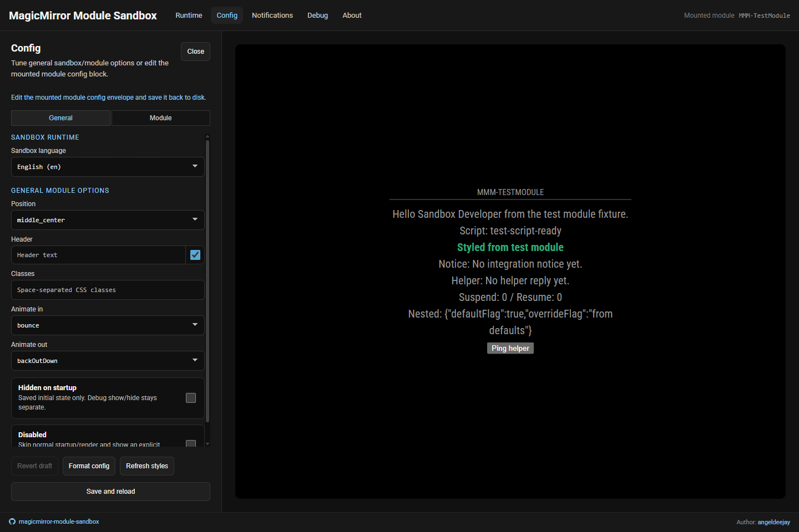
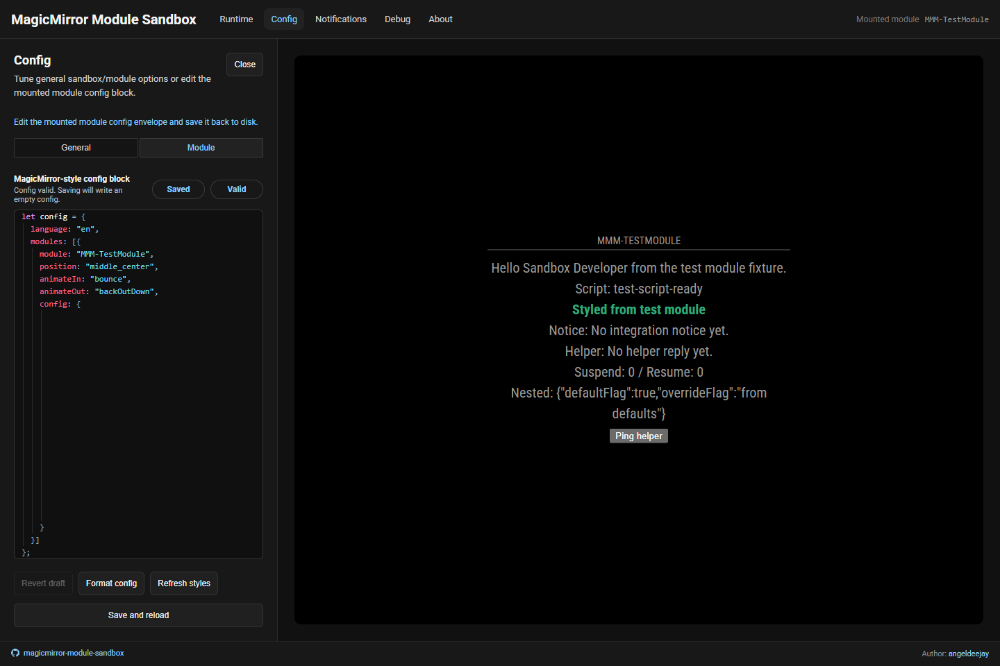

# 🧩 Config

The **Config** area is where you shape the module wrapper and edit the module's
saved JSON config.

## Panels

### General



This panel collects the wrapper-level options and the sandbox language used for
the mounted module:

- **Sandbox language** changes the runtime language exposed through
  `config.language` and `Translator`.
- **Position** sets the MagicMirror position used by the mounted module wrapper.
- **Header** follows MagicMirror's default header semantics: `false` hides it, an empty string falls back to the module name, and any non-empty string is rendered exactly as entered.
- **Classes** adds wrapper CSS classes to the mounted module container.
- **Animate in** sets the entry animation used when the module becomes visible.
- **Animate out** sets the exit animation used when the module becomes hidden.
- **Hidden on startup** saves the initial hidden state for the next reload.
- **Disabled** skips normal startup/render and shows the explicit disabled
  viewport state instead.

### Module



This panel gives you the embedded JSON editor for the module's nested `config`
object:

- the editor starts from the persisted JSON object for the currently mounted
  module only
- in the default plug-and-play flow, another module repo gets its own empty
  `{}` object until that project saves something
- the non-editable wrapper preview around the editor reflects the current
  General panel settings so you can see how the final config envelope will look

### Footer actions

Both panels share the same footer actions:

- **Revert draft** restores the General controls, sandbox language, and nested
  module `config` body to the last saved sandbox state.
- **Format config** rewrites the nested `config` body with the editor's
  normalized formatting, without saving yet.
- **Refresh styles** reloads only the stylesheets declared by `getStyles()`
  without a full viewport reload.
- **Save and reload** writes the current config envelope plus the current
  sandbox language selection through the backend.

## Save behavior

By default the mounted-module config lives in a sandbox-owned temp file shaped like:

```text
<system-temp>/magicmirror-module-sandbox/module.config.<hash>.json
```

The sandbox runtime language/locale settings live beside it in:

```text
<system-temp>/magicmirror-module-sandbox/runtime.config.<hash>.json
```

The frontend does not write to disk directly. The backend saves the file and
then reloads the mounted-module viewport. This keeps sandbox artifacts out of
the mounted module tree.

## When it helps most

Open Config when you want to:

- adjust supported MagicMirror-style wrapper fields from **General**
- switch the runtime language used for `config.language` / `Translator`
- edit the mounted module's nested JSON from **Module**
- test how a config change affects runtime behavior after reload
- force-refresh only module CSS when iterating on stylesheet changes

## Notes

- The editor now tracks whether the current draft matches the saved sandbox
  state, but it is still evolving toward a more MagicMirror-like config feel.
- The language list mirrors the supported MagicMirror core language codes.
- `hiddenOnStartup` is a persisted initial state only. The Runtime sidebar `Show` / `Hide` buttons stay debug tools.
- `disabled` skips normal startup/render and shows an explicit disabled viewport state until you re-enable the mounted module.
- `configDeepMerge` stays supported internally but is not exposed as a visible control.
- If watch mode is off, the backend restarts the helper immediately after save and reloads the viewport.
- If watch mode is on, the normal watch/reload flow takes over and stage-local changes reload only the viewport.
- `Refresh styles` appends a cache-busting token to mounted-module CSS URLs so browser cache hits do not hide stylesheet edits.
