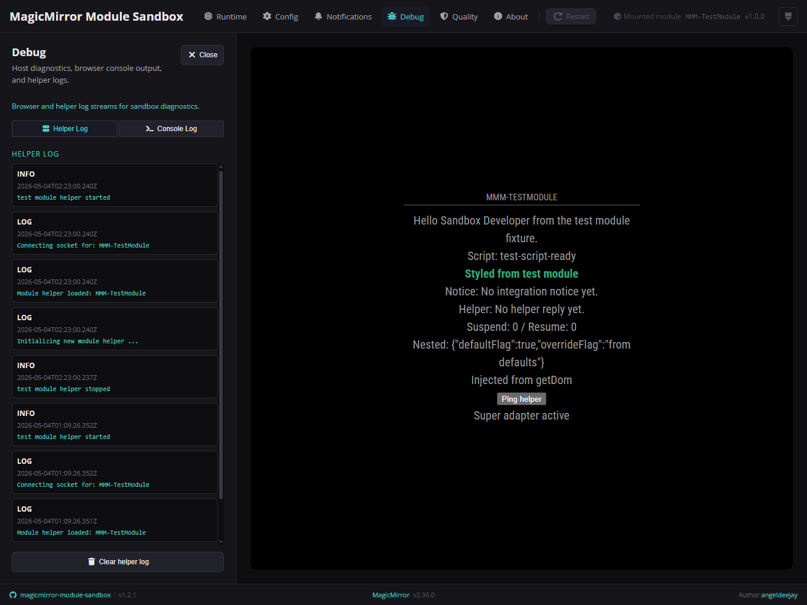
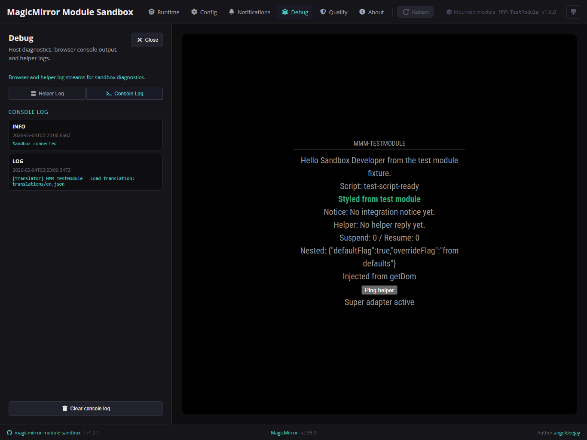

# 🐞 Debug

The **Debug** area gives you the browser and helper logs in one place.

## Panels

### Helper Log

This panel shows `node_helper` log entries mirrored from the server process.

### Console Log

This panel shows browser-side runtime log entries captured by the sandbox.

## When it helps most

Open Debug when you want to:

- inspect browser-side logs without opening devtools first
- inspect helper-side logs while keeping the browser and backend context together
- confirm quickly whether a mounted module booted without a `node_helper.js` because the helper log will remain empty in frontend-only runs

## Notes

- Console and helper logs are bounded and incrementally updated.
- Helper log entries are mirrored through the root Socket.IO channel.
- This domain is for diagnostics; it is not a replacement for deeper tracing when you need low-level browser tooling.
