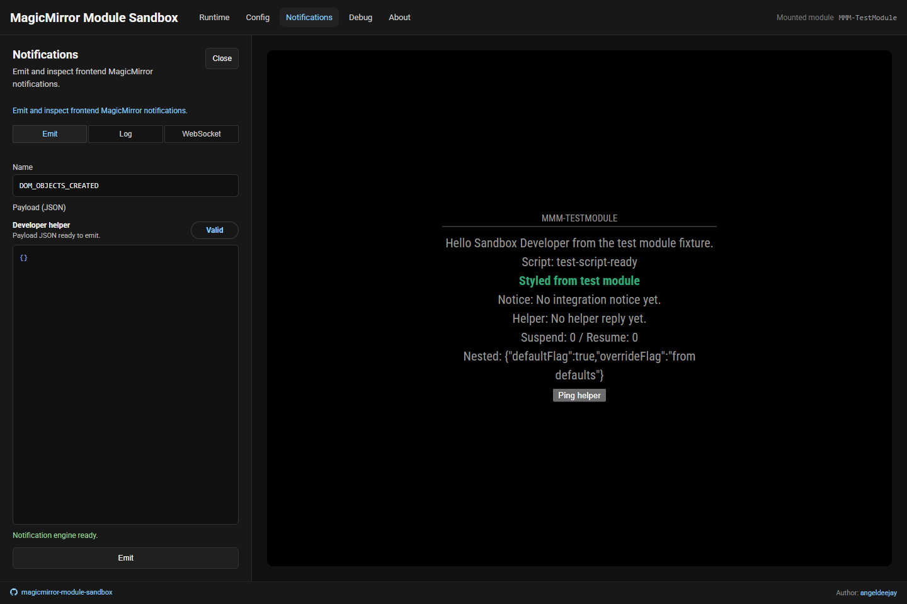
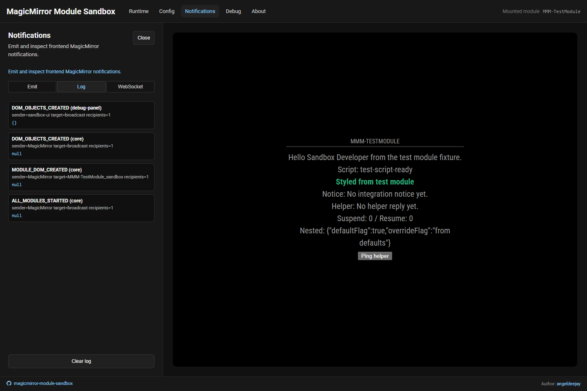
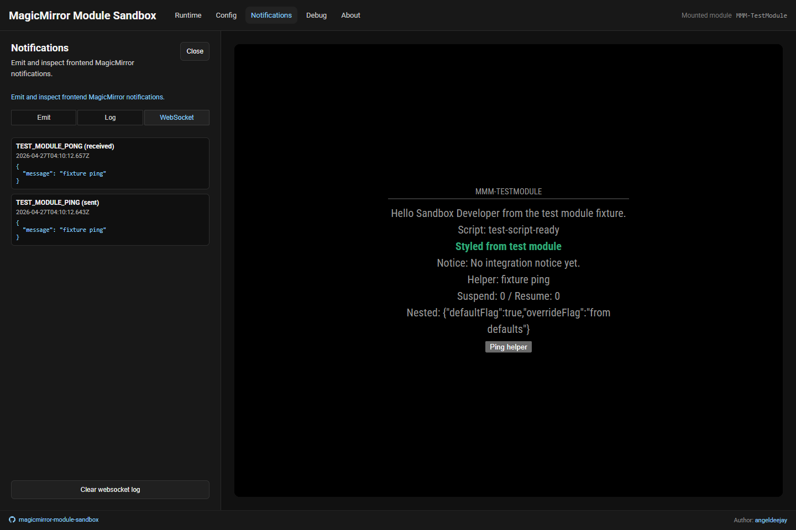

# 🔔 Notifications

The **Notifications** area is your small test bench for frontend notifications.

## Panels

### Emit

This panel lets you fire one frontend MagicMirror notification with:

- a notification name
- a JSON payload editor
- guarded validation before emit

### Log

This panel shows the frontend notification log captured by the sandbox bus.

### WebSocket

This panel shows Socket.IO traffic between the mounted frontend module and the
real helper.

## When it helps most

Open Notifications when you want to:

- test `sendNotification(...)` and `notificationReceived(...)`
- inspect which recipients received one notification
- inspect helper traffic without opening external tooling
- verify frontend-only modules separately from helper-backed notification flows

## Notes

- Notification payloads are cloned into JSON-safe values for logging.
- The log views are bounded and updated incrementally rather than fully re-rendered on every event.
- Clear actions reset the visible history for that panel only.
- Helper WebSocket activity appears only when the mounted module actually ships and boots `node_helper.js`.
