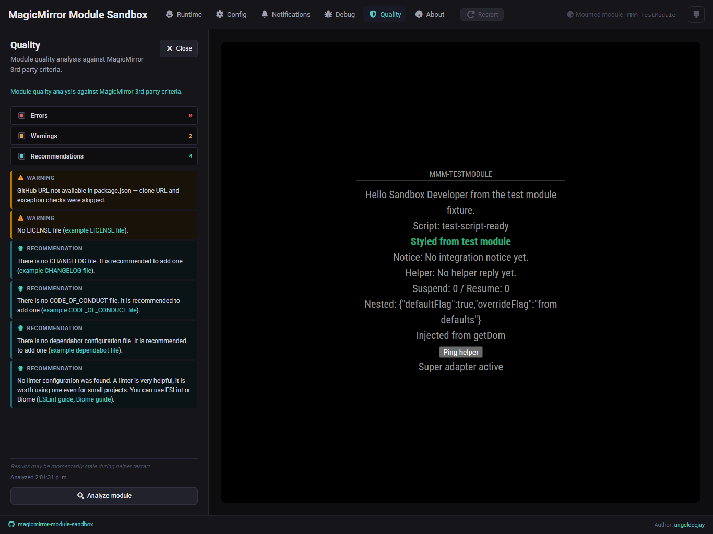

# 🔍 Quality

The **Quality** area runs a static analysis of your mounted module against
MagicMirror 3rd-party module criteria and shows the results in one place.

## What you will see

Findings are organized by severity:

- **Errors** — issues that are likely to break or block the module
- **Warnings** — patterns that can cause unexpected behavior
- **Recommendations** — suggestions aligned with MagicMirror 3rd-party criteria

Each finding includes a short description. The severity filter checkboxes let
you narrow the list to the category you care about.

The footer shows when the last analysis ran. A stale note appears briefly
during helper restarts while a fresh result is on the way.

## Running an analysis

The **Analyze module** button triggers a fresh analysis on demand. In watch
mode the sandbox also re-analyzes automatically when module files change.

## When it helps most

Open Quality when you want to:

- get a quick read on common module issues before publishing or sharing
- work through errors and warnings one category at a time using the filters
- confirm that a fix resolved a specific finding without running a separate
  linter or check outside the sandbox

## Notes

- Analysis runs against the mounted module's source files, not a built bundle.
- Results reflect the criteria from the MagicMirror 3rd-party module
  repository at the time the sandbox was built.
- Quality is a diagnostic aid, not a strict pass/fail gate. Errors are
  worth fixing; warnings and recommendations are worth reviewing.
- The panel shows results for one module at a time — whichever module is
  currently mounted.
