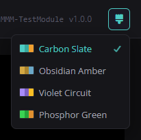
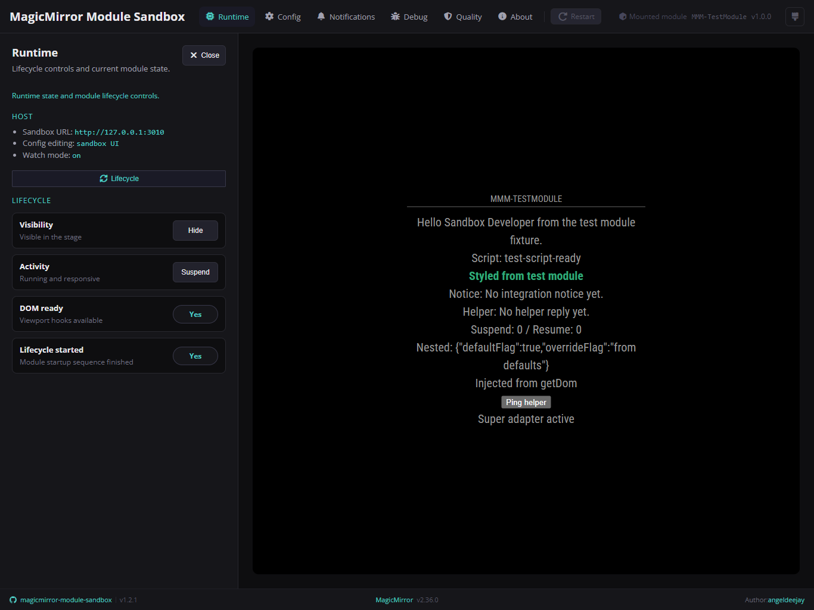
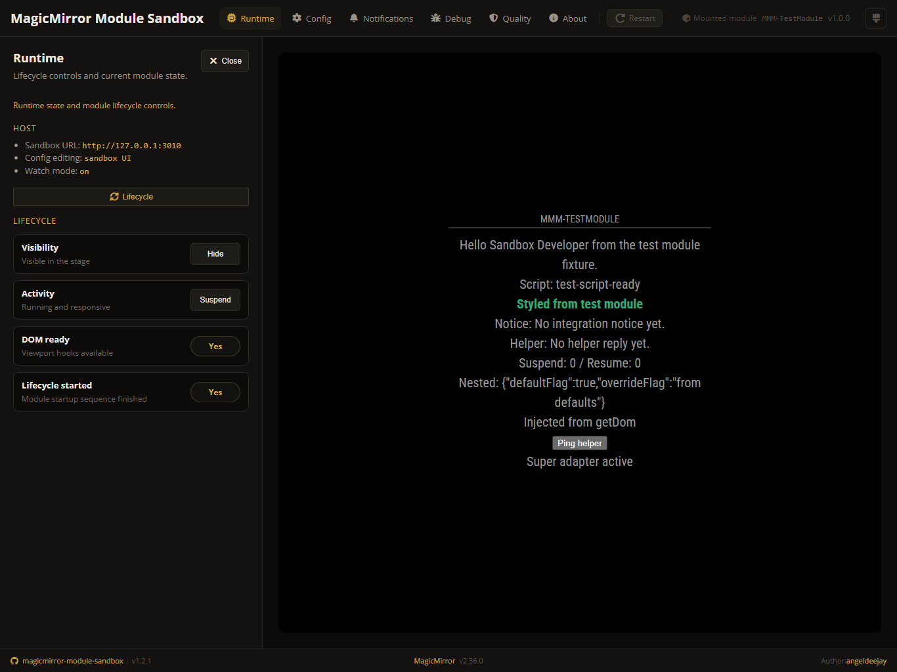
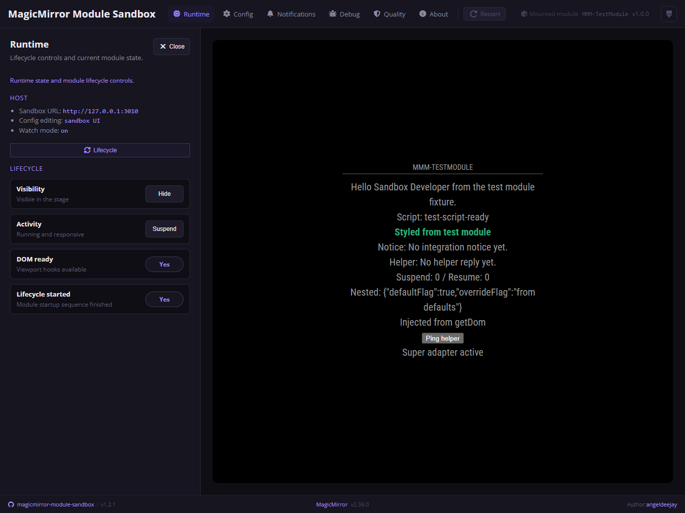
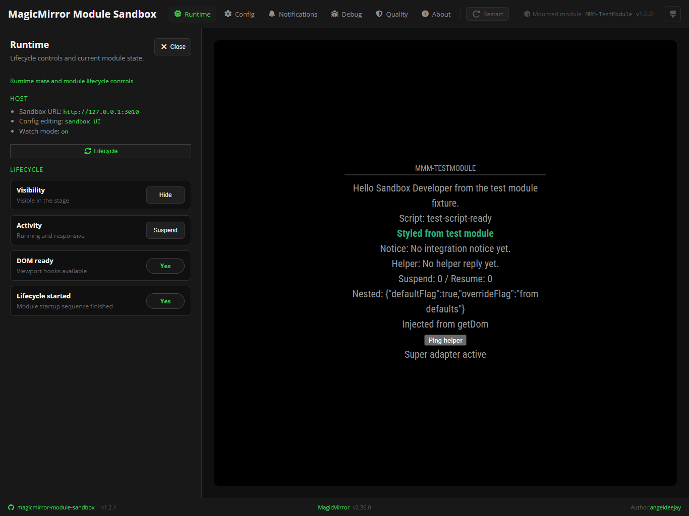

# 🎨 Themes

The sandbox ships four built-in themes that change the shell color palette
without affecting the mounted module or the stage iframe.

## Switching themes

The brush icon button in the topbar opens a dropdown listing all four themes
with color-swatch previews and a check mark on the active selection. The chosen
theme persists across sessions via `localStorage` — no page reload needed.

## Available themes

### Carbon Slate

The default theme. Deep carbon background with a teal/cyan accent. Designed for
long sessions in low-light environments.

### Obsidian Amber

Near-black background with a warm golden amber accent. Reminiscent of classic
amber phosphor displays.

### Violet Circuit

Dark background with a lavender/purple accent. Clean and modern, easy on the
eyes for extended use.

### Phosphor Green

Black background with a bright terminal green accent. Evokes classic green
phosphor monitors.

## Notes

- Themes apply only to the sandbox shell UI. The mounted module stage runs inside
  an isolated iframe and is not affected.
- The active theme is stored under the `harness-theme` key in `localStorage` and
  reapplied server-side on the next page load to prevent a flash of the default
  theme.
- All four themes share the same layout, spacing, and icon set — only the color
  palette changes.
